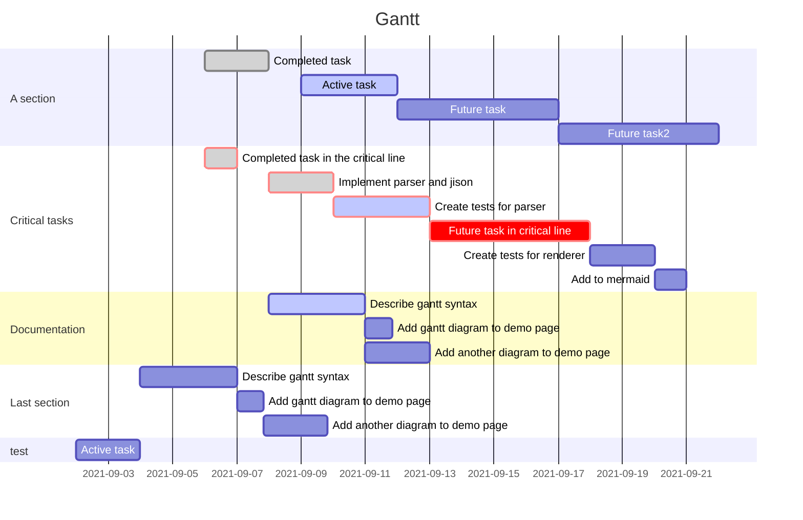

 

# PM-projectname 

 

## 🏆 Goal 
> 프로젝트의 목표를 작성한다. 

 

## 📅 Scheduel
> 프로젝트의 일정을 작성한다. 
> 프로젝트의 일정을 표현하는 라는 태그를 달아서 tasks에서 볼 수 있도록 한다. 
> 내가 설정한 Milestone 마감 기한도 이곳에 작성한다. 

 

## 💎Milestones 
> 중간 지점을 표현한다 

 

## ✅Tasks 
- 각 마일스톤을 달성하기 위해서 필요한 태스크들을 하나씩 열거한다. 
- 할당시간과 그에 따른 마감일 기록한다. 

 

## 📊 Gantt 
> 스케쥴을 바탕으로 Gantt 차트를 작성한다. 

--- 
## Reference